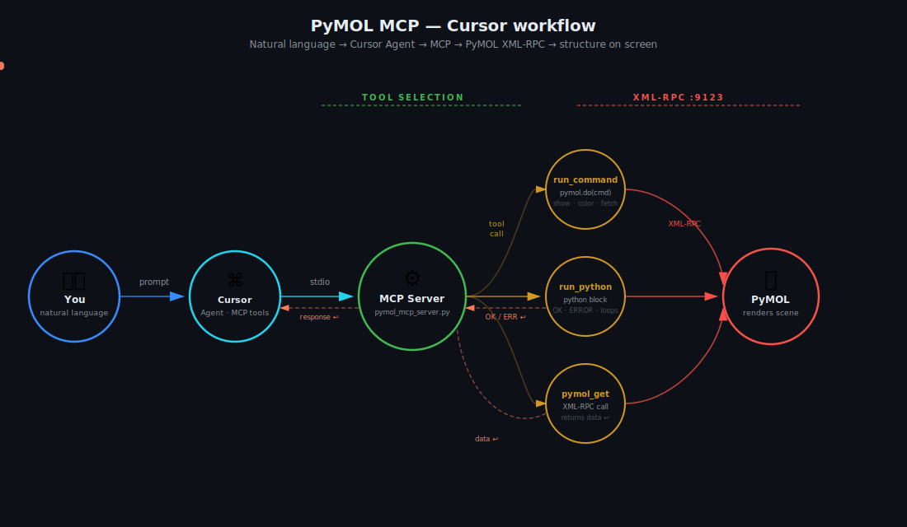

# pymol-cursor-mcp - Truong Nguyen

**Control [PyMOL](https://pymol.org) from [Cursor](https://cursor.com)** via the **Model Context Protocol (MCP)**. Describe structures and styles in plain language; the assistant calls PyMOL through XML‑RPC (`run_command`, `run_python`, `pymol_get`).

This project packages and documents a **Cursor-first** workflow. The same MCP server works with **Claude Code** if you prefer that CLI.

**Upstream inspiration:** [nagarh/pymol-claude-code](https://github.com/nagarh/pymol-claude-code) (PyMOL + MCP for Claude Code). This repo extends that idea with portable Cursor config, checks, scripts, and install docs.

---

## Architecture

<p align="center">
  
</p>

Same diagram style as [upstream `flow.svg`](https://github.com/nagarh/pymol-claude-code/blob/main/flow.svg), updated for **Cursor** (cyan node). Uses SVG/CSS animation (`animateMotion`, keyframes). If your Markdown preview looks static, open [`flow.svg`](flow.svg) directly on GitHub for the full motion.

## What you get

| Piece | Purpose |
|--------|---------|
| `pymol_mcp_server.py` | MCP server (stdio) → PyMOL XML‑RPC |
| `.cursor/mcp.json` | Registers the `pymol` MCP server using `${workspaceFolder}` |
| `.cursor/rules/*.mdc` | Agent hints for PyMOL tool usage |
| `scripts/start_pymol_for_mcp.sh` | Launch PyMOL with `-R` (macOS/Linux) |
| `verify_stack.py` | Sanity check: venv + MCP import + RPC to PyMOL |
| `examples/restore_pocket_labels.pml` | Example PyMOL script (labels / pocket) |
| `flow.svg` | Animated architecture diagram (same style as upstream repo) |

---

## Quick install

```bash
git clone https://github.com/truong128/pymol-cursor-mcp.git
cd pymol-cursor-mcp

python3 -m venv venv
source venv/bin/activate          # Windows: venv\Scripts\activate
pip install -U pip
pip install -r requirements.txt
deactivate
```

Install **PyMOL** (conda‑forge recommended), then start RPC:

```bash
conda activate pymol_mcp          # your env with pymol-open-source
pymol -R
```

Or: `./scripts/start_pymol_for_mcp.sh` (after `chmod +x`).

In **Cursor**: **Open Folder** → this repo → **Settings → MCP** → confirm **`pymol`** connected → restart Cursor if needed.

```bash
python3 verify_stack.py
```

Should print: `OK: MCP import + PyMOL RPC at http://localhost:9123`

**Full step-by-step:** [INSTALL.md](INSTALL.md)

---

## Daily use

1. **Terminal:** `pymol -R` or **VS Code/Cursor task:** “PyMOL: start with XML-RPC”.  
2. **Cursor:** Chat / Agent with this folder open.  
3. **Prompt:** e.g. “Fetch 1hvr, cartoon on protein, sticks on ligand.”

---

## Summary of changes vs “Claude Code only” upstream

| Topic | Here |
|--------|------|
| IDE | **Cursor** primary; `.cursor/mcp.json`, rules, tasks |
| RPC URL | `PYMOL_RPC_URL` env (default `http://localhost:9123`) |
| Paths | `${workspaceFolder}` — clone anywhere |
| Windows | `.cursor/mcp.json.windows.example` |
| Verify | `verify_stack.py` |
| PyMOL start | `scripts/start_pymol_for_mcp.sh` + Run Task |

---

## Troubleshooting

- **MCP disconnected:** see Cursor **Output → MCP Logs**; recreate `venv`; reopen repo root as workspace.  
- **PyMOL errors / missing `.dylib`:** install PyMOL from **conda-forge** into a dedicated env (see INSTALL.md).  
- **Remote/HPC:** run MCP where your editor runs; tunnel RPC (`PYMOL_RPC_URL`, SSH `-R`) — details in INSTALL.md.

---

## Credits

- PyMOL MCP idea and original server: **[pymol-claude-code](https://github.com/nagarh/pymol-claude-code)** — Hemant Nagar.  
- Packaging and Cursor-focused docs: **[truong128](https://github.com/truong128)**.

## License

MIT — see [LICENSE](LICENSE).
